```python
import numpy as np
import pandas as pd
import matplotlib.pyplot as plt
import seaborn as sns
```


```python
df=pd.read_csv('FullData.csv')
df.head(7)
```


<div>
<style scoped>
    .dataframe tbody tr th:only-of-type {
        vertical-align: middle;
    }

    .dataframe tbody tr th {
        vertical-align: top;
    }

    .dataframe thead th {
        text-align: right;
    }
</style>
<table border="1" class="dataframe">
  <thead>
    <tr style="text-align: right;">
      <th></th>
      <th>Name</th>
      <th>Nationality</th>
      <th>National_Position</th>
      <th>National_Kit</th>
      <th>Club</th>
      <th>Club_Position</th>
      <th>Club_Kit</th>
      <th>Club_Joining</th>
      <th>Contract_Expiry</th>
      <th>Rating</th>
      <th>...</th>
      <th>Long_Shots</th>
      <th>Curve</th>
      <th>Freekick_Accuracy</th>
      <th>Penalties</th>
      <th>Volleys</th>
      <th>GK_Positioning</th>
      <th>GK_Diving</th>
      <th>GK_Kicking</th>
      <th>GK_Handling</th>
      <th>GK_Reflexes</th>
    </tr>
  </thead>
  <tbody>
    <tr>
      <th>0</th>
      <td>Cristiano Ronaldo</td>
      <td>Portugal</td>
      <td>LS</td>
      <td>7.0</td>
      <td>Real Madrid</td>
      <td>LW</td>
      <td>7.0</td>
      <td>07/01/2009</td>
      <td>2021.0</td>
      <td>94</td>
      <td>...</td>
      <td>90</td>
      <td>81</td>
      <td>76</td>
      <td>85</td>
      <td>88</td>
      <td>14</td>
      <td>7</td>
      <td>15</td>
      <td>11</td>
      <td>11</td>
    </tr>
    <tr>
      <th>1</th>
      <td>Lionel Messi</td>
      <td>Argentina</td>
      <td>RW</td>
      <td>10.0</td>
      <td>FC Barcelona</td>
      <td>RW</td>
      <td>10.0</td>
      <td>07/01/2004</td>
      <td>2018.0</td>
      <td>93</td>
      <td>...</td>
      <td>88</td>
      <td>89</td>
      <td>90</td>
      <td>74</td>
      <td>85</td>
      <td>14</td>
      <td>6</td>
      <td>15</td>
      <td>11</td>
      <td>8</td>
    </tr>
    <tr>
      <th>2</th>
      <td>Neymar</td>
      <td>Brazil</td>
      <td>LW</td>
      <td>10.0</td>
      <td>FC Barcelona</td>
      <td>LW</td>
      <td>11.0</td>
      <td>07/01/2013</td>
      <td>2021.0</td>
      <td>92</td>
      <td>...</td>
      <td>77</td>
      <td>79</td>
      <td>84</td>
      <td>81</td>
      <td>83</td>
      <td>15</td>
      <td>9</td>
      <td>15</td>
      <td>9</td>
      <td>11</td>
    </tr>
    <tr>
      <th>3</th>
      <td>Luis Suárez</td>
      <td>Uruguay</td>
      <td>LS</td>
      <td>9.0</td>
      <td>FC Barcelona</td>
      <td>ST</td>
      <td>9.0</td>
      <td>07/11/2014</td>
      <td>2021.0</td>
      <td>92</td>
      <td>...</td>
      <td>86</td>
      <td>86</td>
      <td>84</td>
      <td>85</td>
      <td>88</td>
      <td>33</td>
      <td>27</td>
      <td>31</td>
      <td>25</td>
      <td>37</td>
    </tr>
    <tr>
      <th>4</th>
      <td>Manuel Neuer</td>
      <td>Germany</td>
      <td>GK</td>
      <td>1.0</td>
      <td>FC Bayern</td>
      <td>GK</td>
      <td>1.0</td>
      <td>07/01/2011</td>
      <td>2021.0</td>
      <td>92</td>
      <td>...</td>
      <td>16</td>
      <td>14</td>
      <td>11</td>
      <td>47</td>
      <td>11</td>
      <td>91</td>
      <td>89</td>
      <td>95</td>
      <td>90</td>
      <td>89</td>
    </tr>
    <tr>
      <th>5</th>
      <td>De Gea</td>
      <td>Spain</td>
      <td>GK</td>
      <td>1.0</td>
      <td>Manchester Utd</td>
      <td>GK</td>
      <td>1.0</td>
      <td>07/01/2011</td>
      <td>2019.0</td>
      <td>90</td>
      <td>...</td>
      <td>12</td>
      <td>21</td>
      <td>19</td>
      <td>40</td>
      <td>13</td>
      <td>86</td>
      <td>88</td>
      <td>87</td>
      <td>85</td>
      <td>90</td>
    </tr>
    <tr>
      <th>6</th>
      <td>Robert Lewandowski</td>
      <td>Poland</td>
      <td>LS</td>
      <td>9.0</td>
      <td>FC Bayern</td>
      <td>ST</td>
      <td>9.0</td>
      <td>07/01/2014</td>
      <td>2021.0</td>
      <td>90</td>
      <td>...</td>
      <td>82</td>
      <td>77</td>
      <td>76</td>
      <td>81</td>
      <td>86</td>
      <td>8</td>
      <td>15</td>
      <td>12</td>
      <td>6</td>
      <td>10</td>
    </tr>
  </tbody>
</table>
<p>7 rows × 53 columns</p>
</div>


```python
del df['National_Kit'] ### DELETE THE NATIONAL KIT COLUMN
df.head()
```


<div>
<style scoped>
    .dataframe tbody tr th:only-of-type {
        vertical-align: middle;
    }

    .dataframe tbody tr th {
        vertical-align: top;
    }

    .dataframe thead th {
        text-align: right;
    }
</style>
<table border="1" class="dataframe">
  <thead>
    <tr style="text-align: right;">
      <th></th>
      <th>Name</th>
      <th>Nationality</th>
      <th>National_Position</th>
      <th>Club</th>
      <th>Club_Position</th>
      <th>Club_Kit</th>
      <th>Club_Joining</th>
      <th>Contract_Expiry</th>
      <th>Rating</th>
      <th>Height</th>
      <th>...</th>
      <th>Long_Shots</th>
      <th>Curve</th>
      <th>Freekick_Accuracy</th>
      <th>Penalties</th>
      <th>Volleys</th>
      <th>GK_Positioning</th>
      <th>GK_Diving</th>
      <th>GK_Kicking</th>
      <th>GK_Handling</th>
      <th>GK_Reflexes</th>
    </tr>
  </thead>
  <tbody>
    <tr>
      <th>0</th>
      <td>Cristiano Ronaldo</td>
      <td>Portugal</td>
      <td>LS</td>
      <td>Real Madrid</td>
      <td>LW</td>
      <td>7.0</td>
      <td>07/01/2009</td>
      <td>2021.0</td>
      <td>94</td>
      <td>185 cm</td>
      <td>...</td>
      <td>90</td>
      <td>81</td>
      <td>76</td>
      <td>85</td>
      <td>88</td>
      <td>14</td>
      <td>7</td>
      <td>15</td>
      <td>11</td>
      <td>11</td>
    </tr>
    <tr>
      <th>1</th>
      <td>Lionel Messi</td>
      <td>Argentina</td>
      <td>RW</td>
      <td>FC Barcelona</td>
      <td>RW</td>
      <td>10.0</td>
      <td>07/01/2004</td>
      <td>2018.0</td>
      <td>93</td>
      <td>170 cm</td>
      <td>...</td>
      <td>88</td>
      <td>89</td>
      <td>90</td>
      <td>74</td>
      <td>85</td>
      <td>14</td>
      <td>6</td>
      <td>15</td>
      <td>11</td>
      <td>8</td>
    </tr>
    <tr>
      <th>2</th>
      <td>Neymar</td>
      <td>Brazil</td>
      <td>LW</td>
      <td>FC Barcelona</td>
      <td>LW</td>
      <td>11.0</td>
      <td>07/01/2013</td>
      <td>2021.0</td>
      <td>92</td>
      <td>174 cm</td>
      <td>...</td>
      <td>77</td>
      <td>79</td>
      <td>84</td>
      <td>81</td>
      <td>83</td>
      <td>15</td>
      <td>9</td>
      <td>15</td>
      <td>9</td>
      <td>11</td>
    </tr>
    <tr>
      <th>3</th>
      <td>Luis Suárez</td>
      <td>Uruguay</td>
      <td>LS</td>
      <td>FC Barcelona</td>
      <td>ST</td>
      <td>9.0</td>
      <td>07/11/2014</td>
      <td>2021.0</td>
      <td>92</td>
      <td>182 cm</td>
      <td>...</td>
      <td>86</td>
      <td>86</td>
      <td>84</td>
      <td>85</td>
      <td>88</td>
      <td>33</td>
      <td>27</td>
      <td>31</td>
      <td>25</td>
      <td>37</td>
    </tr>
    <tr>
      <th>4</th>
      <td>Manuel Neuer</td>
      <td>Germany</td>
      <td>GK</td>
      <td>FC Bayern</td>
      <td>GK</td>
      <td>1.0</td>
      <td>07/01/2011</td>
      <td>2021.0</td>
      <td>92</td>
      <td>193 cm</td>
      <td>...</td>
      <td>16</td>
      <td>14</td>
      <td>11</td>
      <td>47</td>
      <td>11</td>
      <td>91</td>
      <td>89</td>
      <td>95</td>
      <td>90</td>
      <td>89</td>
    </tr>
  </tbody>
</table>
<p>5 rows × 52 columns</p>
</div>


```python
plt.figure(figsize=(15,32))
sns.countplot(y=df.Nationality,palette='Set2')

```


    <matplotlib.axes._subplots.AxesSubplot at 0x1e8ef71d160>


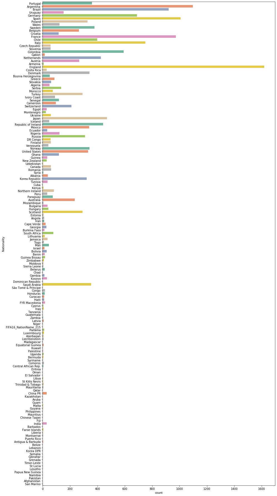


```python
plt.figure(figsize=(15,4))
sns.countplot(x="Age",data=df)
```


    <matplotlib.axes._subplots.AxesSubplot at 0x1e8f64d2940>


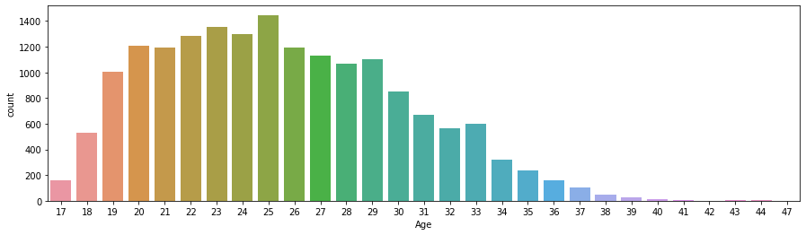


### BEST GK


```python
#WEIGHTS

a=0.5
b=1
c=2
d=3
```


```python
#Gk Characteristics
df['gk_Shot_Stopper']= (b*df.Reactions+b*df.Composure+a*df.Speed+a*df.Strength+b*df.Jumping+b*df.GK_Positioning+c*df.GK_Diving+d*df.GK_Reflexes+b*df.GK_Handling)/(2*a+4*b+2*c+1*d)

df['gk_Sweeper']=(d*df.Reactions+b*df.Composure+d*df.Speed+c*df.Strength+a*df.Jumping+c*df.GK_Positioning+b*df.GK_Diving+d*df.GK_Reflexes+b*df.GK_Handling)/(2*a+4*b+2*c+1*d)
```


```python
plt.figure(figsize=(15,6))
sd1=df.sort_values('gk_Shot_Stopper', ascending = False )[0:5]
x1=np.array(list(sd1["Name"]))
y1=np.array(list(sd1["gk_Shot_Stopper"]))

sns.barplot(x1,y1,palette='colorblind')
plt.ylabel("Sweeping Score")
```


    Text(0, 0.5, 'Sweeping Score')


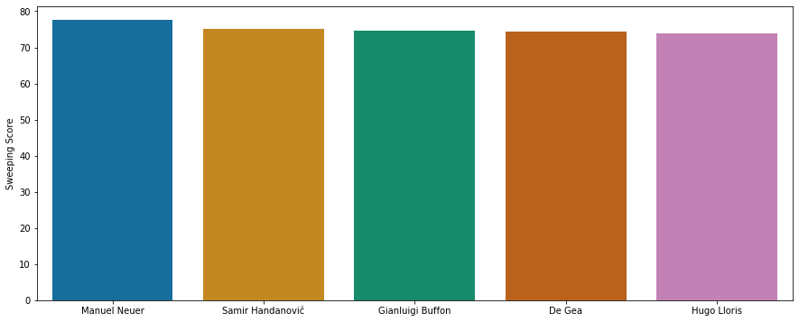


```python
plt.figure(figsize=(15,6))
sd1=df.sort_values('gk_Sweeper', ascending = False )[0:5] ### DESCENDING ORDER
x1=np.array(list(sd1["Name"]))
y1=np.array(list(sd1["gk_Sweeper"]))

sns.barplot(x1,y1,palette='colorblind')
plt.ylabel("Sweeping Score")
```


    Text(0, 0.5, 'Sweeping Score')


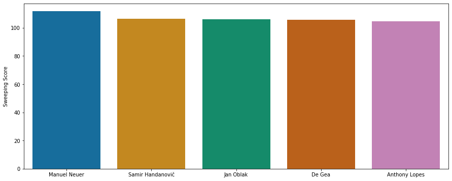


### MANUEL NEUER IS THE BEST GK

## 4 Best Defenders


```python
df['df_cb']=(d*df.Reactions+c*df.Interceptions+d*df.Sliding_Tackle+d*df.Standing_Tackle+b*df.Vision+b*df.Composure)
df['df_wb']=(c*df.Reactions+c*df.Interceptions+d*df.Sliding_Tackle+b*df.Standing_Tackle+b*df.Vision+b*df.Composure)

```


```python
plt.figure(figsize=(15,6))
sd=df[(df['Club_Position']=='LCB')].sort_values('df_cb', ascending=False)[0:5]
x1=np.array(list(sd['Name']))
y1=np.array(list(sd['df_cb']))

sns.barplot(x1,y1,palette='colorblind')
plt.ylabel("LCB Score")
```


    Text(0, 0.5, 'LCB Score')


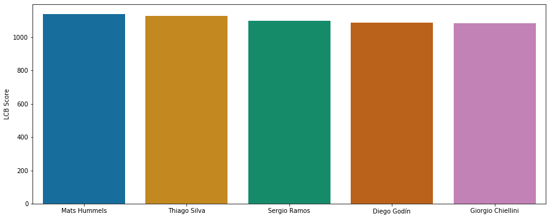


```python
plt.figure(figsize=(15,6))
sd=df[(df['Club_Position']=='RCB')].sort_values('df_cb', ascending=False)[0:5]
x1=np.array(list(sd['Name']))
y1=np.array(list(sd['df_cb']))

sns.barplot(x1,y1,palette='colorblind')
plt.ylabel("RCB Score")
```


    Text(0, 0.5, 'RCB Score')


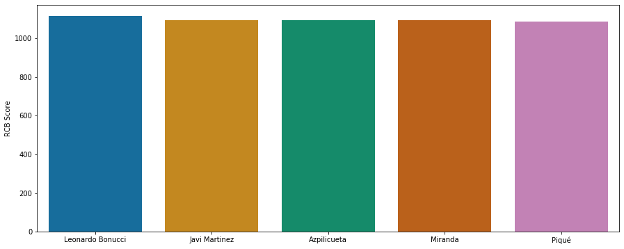


```python
plt.figure(figsize=(15,6))
sd=df[(df['Club_Position']=='LWB') | (df['Club_Position']=='LB')].sort_values('df_wb', ascending=False)[0:5]
x1=np.array(list(sd['Name']))
y1=np.array(list(sd['df_wb']))

sns.barplot(x1,y1,palette='colorblind')
plt.ylabel("LWB Score")
```


    Text(0, 0.5, 'LWB Score')


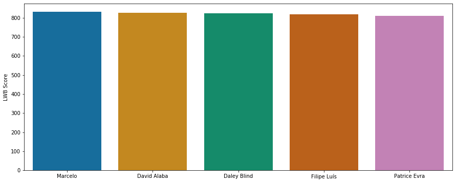


```python
plt.figure(figsize=(15,6))
sd=df[(df['Club_Position']=='RWB') | (df['Club_Position']=='RB')].sort_values('df_wb', ascending=False)[0:5]
x1=np.array(list(sd['Name']))
y1=np.array(list(sd['df_wb']))

sns.barplot(x1,y1,palette='colorblind')
plt.ylabel("RWB Score")
```


    Text(0, 0.5, 'RWB Score')


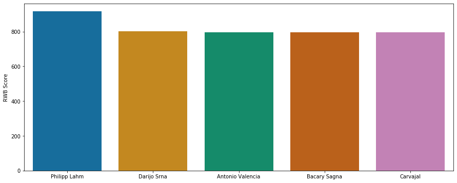


### BEST MIDFIELD


```python
### MIDFIELD
```


```python
df['df_controller']=(b*df.Weak_foot+d*df.Ball_Control+a*df.Dribbling+a*df.Marking+a*df.Reactions+c*df.Vision+d*df.Composure)/(2*a+b+c+2*d)
df['df_playmaker']=(d*df.Ball_Control+d*df.Dribbling+a*df.Marking+d*df.Vision+c*df.Attacking_Position+c*df.Crossing+c*df.Curve+b*df.Long_Shots+c*df.Freekick_Accuracy)/(2*a+b+4*c+3*d)
df['df_beast']=(d*df.Agility+c*df.Balance+b*df.Jumping+d*df.Stamina+c*df.Strength+a*df.Speed+c*df.Acceleration+d*df.Short_Pass)/(a+b+3*c+3*d)
```


```python
#plot Controller
plt.figure(figsize=(15,6))
sd=df[(df['Club_Position']=='LCM') | (df['Club_Position']=='LM')].sort_values('df_controller', ascending=False)[0:5]
x1=np.array(list(sd['Name']))
y1=np.array(list(sd['df_controller']))

sns.barplot(x1,y1,palette='colorblind')
plt.ylabel("LM Score")
```


    Text(0, 0.5, 'LM Score')


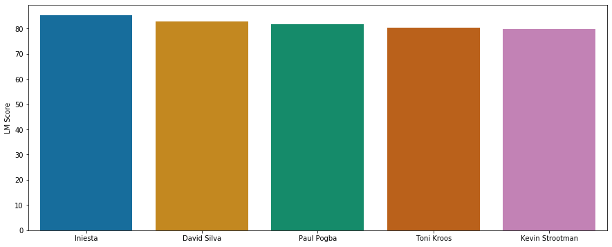


```python
#plot Playmaker
plt.figure(figsize=(15,6))
sd=df[(df['Club_Position']=='CM') | (df['Club_Position']=='CAM')].sort_values('df_controller', ascending=False)[0:5]
x1=np.array(list(sd['Name']))
y1=np.array(list(sd['df_playmaker']))

sns.barplot(x1,y1,palette='colorblind')
plt.ylabel("CM Score")
```


    Text(0, 0.5, 'CM Score')


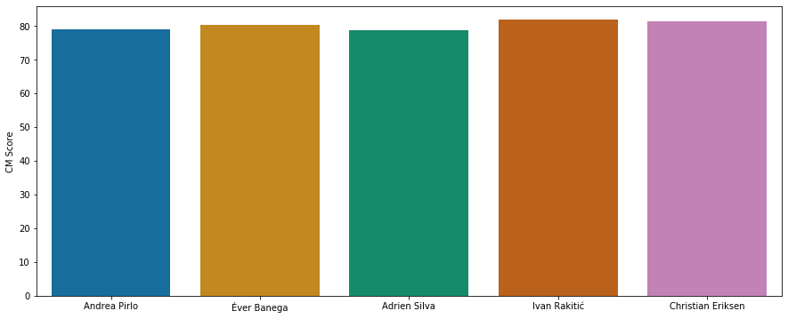


```python
#plot Controller
plt.figure(figsize=(15,6))
sd=df[(df['Club_Position']=='RCM') | (df['Club_Position']=='RM')].sort_values('df_beast', ascending=False)[0:5]
x1=np.array(list(sd['Name']))
y1=np.array(list(sd['df_beast']))

sns.barplot(x1,y1,palette='colorblind')
plt.ylabel("RM Score")
```


    Text(0, 0.5, 'RM Score')


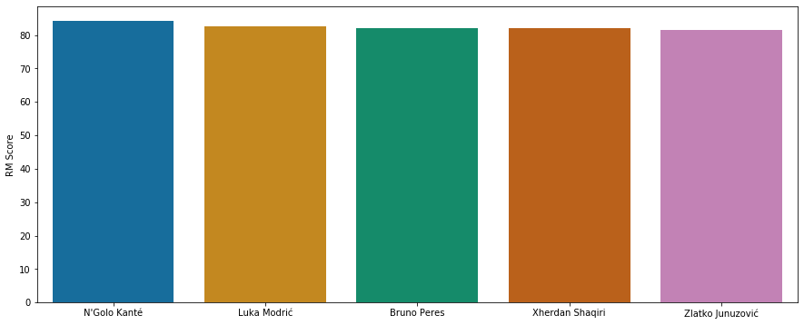


## BEST ATTACKERS


```python
df['df_leftwing']=(b*df.Weak_foot+c*df.Ball_Control+c*df.Dribbling+c*df.Speed+d*df.Acceleration+b*df.Vision+d*df.Crossing+d*df.Finishing)/(a+2*b+3*c+3*d)
df['df_rightwing']=(b*df.Weak_foot+c*df.Ball_Control+c*df.Dribbling+c*df.Speed+d*df.Acceleration+b*df.Vision+d*df.Crossing+d*df.Finishing)/(a+2*b+3*c+3*d)
df['df_striker']=(b*df.Weak_foot+d*df.Heading+d*df.Agility+c*df.Heading+b*df.Jumping+d*df.Stamina+c*df.Strength+a*df.Speed+c*df.Acceleration+d*df.Short_Pass)/(a+2*b+3*c+4*d)
```


```python
#plot LeftWing
plt.figure(figsize=(15,6))
sd=df[(df['Club_Position']=='LW') | (df['Club_Position']=='LS') | (df['Club_Position']=='LM')].sort_values('df_leftwing', ascending=False)[0:5]
x1=np.array(list(sd['Name']))
y1=np.array(list(sd['df_leftwing']))

sns.barplot(x1,y1,palette='colorblind')
plt.ylabel("LW Score")
```


    Text(0, 0.5, 'LW Score')


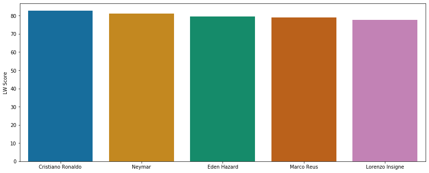


```python
#plot RightWing
plt.figure(figsize=(15,6))
sd=df[(df['Club_Position']=='RW') | (df['Club_Position']=='RS') | (df['Club_Position']=='RM')].sort_values('df_rightwing', ascending=False)[0:5]
x1=np.array(list(sd['Name']))
y1=np.array(list(sd['df_rightwing']))

sns.barplot(x1,y1,palette='colorblind')
plt.ylabel("RW Score")
```


    Text(0, 0.5, 'RW Score')


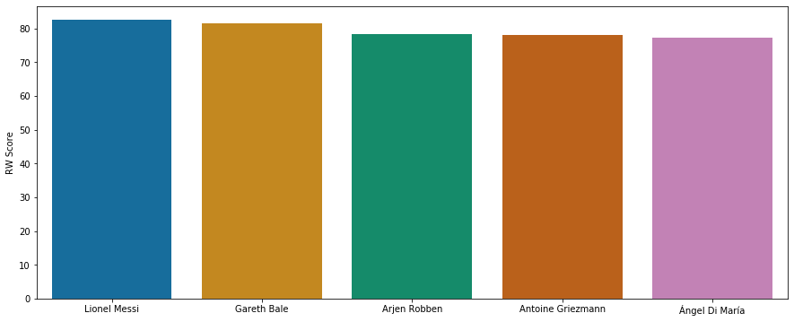


```python
#plot Striker
plt.figure(figsize=(15,6))
sd=df[(df['Club_Position']=='ST') | (df['Club_Position']=='LS') | (df['Club_Position']=='RS')].sort_values('df_striker', ascending=False)[0:5]
x1=np.array(list(sd['Name']))
y1=np.array(list(sd['df_striker']))

sns.barplot(x1,y1,palette='colorblind')
plt.ylabel("ST Score")
```


    Text(0, 0.5, 'ST Score')


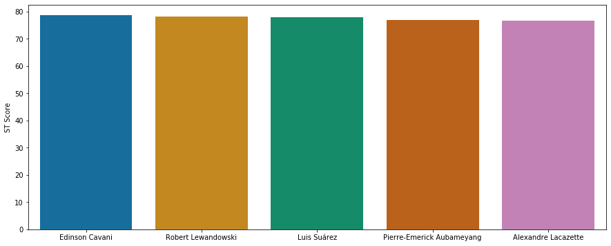


```python

```
